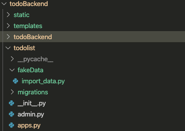

## 2019.12.19
1. 查找跨域问题
    - [django-cors-headers](https://github.com/adamchainz/django-cors-headers)
2. 解决react脚手架搭建问题
    - 脚手架搭建结构不完整，问题原因在于create-react-app不是最新版
    - react项目脚手架项目初始化
3. Django项目初始化
4. 学习virtualenvwrapper使用及配置~/.bashrc
    - pip安装
    - 使用`find / -name virtualenvwrapper.sh`
    - 更改里面python搜寻路径，从python改为pyhton3
    - 之后source使之生效
5. 云服务器的连接
    - 密码连接
    - 秘钥连接
    - 秘钥连接相对更安全
6. 给ubuntu配置新的用户及权限

## 2019.12.20
1. 学习在ubuntu搭建PostgreSQL
    - [How To Use PostgreSQL with your Django Application on Ubuntu](https://www.digitalocean.com/community/tutorials/how-to-use-postgresql-with-your-django-application-on-ubuntu-14-04)
2. 回顾Django的ORM及modelAPI操作
3. todolistmodel构思及完成
4. 一个问题未解决:
想批量导入假数据，但是出现如下错误
``` import_data.py
import sys
import os
# import random
# from datetime import date

pwd = os.path.dirname(os.path.realpath(__file__))
# print(pwd)
sys.path.append('../')
# print(sys.path)
os.environ.setdefault('DJANGO_SETTINGS_MODULE', 'todoBackend.settings')
# print(os.environ.items())
import django
django.setup()
# 此处省略导入逻辑
```
出现如下错误
```
Traceback (most recent call last):
  File "import_data.py", line 16, in <module>
    django.setup()
  File "/Users/fzk27/.virtualenvs/testpy36/lib/python3.6/site-packages/django/__init__.py", line 19, in setup
    configure_logging(settings.LOGGING_CONFIG, settings.LOGGING)
  File "/Users/fzk27/.virtualenvs/testpy36/lib/python3.6/site-packages/django/conf/__init__.py", line 79, in __getattr__
    self._setup(name)
  File "/Users/fzk27/.virtualenvs/testpy36/lib/python3.6/site-packages/django/conf/__init__.py", line 66, in _setup
    self._wrapped = Settings(settings_module)
  File "/Users/fzk27/.virtualenvs/testpy36/lib/python3.6/site-packages/django/conf/__init__.py", line 157, in __init__
    mod = importlib.import_module(self.SETTINGS_MODULE)
  File "/Users/fzk27/.virtualenvs/testpy36/lib/python3.6/importlib/__init__.py", line 126, in import_module
    return _bootstrap._gcd_import(name[level:], package, level)
  File "<frozen importlib._bootstrap>", line 994, in _gcd_import
  File "<frozen importlib._bootstrap>", line 971, in _find_and_load
  File "<frozen importlib._bootstrap>", line 941, in _find_and_load_unlocked
  File "<frozen importlib._bootstrap>", line 219, in _call_with_frames_removed
  File "<frozen importlib._bootstrap>", line 994, in _gcd_import
  File "<frozen importlib._bootstrap>", line 971, in _find_and_load
  File "<frozen importlib._bootstrap>", line 953, in _find_and_load_unlocked
ModuleNotFoundError: No module named 'todoBackend'
The terminal process terminated with exit code: 1
```
项目结构如图：
没有明白为什么出现：No module named 'todoBackend'
反思：批量导入是必经之途，手动导入小项目没有问题，大的项目就会很麻烦了。

## 2019.12.21
1. 研究下manager，models API巩固
2. 对外api操作重新封装供以后视图函数调用
3. 研究下Django的serialize和数据库的transaction的使用
4. 优化重构后端api方法

## 2019.12.22
1. 临时有事，什么都没写
2. 抽空看了一下django官方文档的处理请求流程

## 2019.12.23
1. URL配置，视图函数配置
2. 前端组件配置,差最后一个编辑任务组件

## 2019.12.24
1. 使用axios请求数据
2. 调整后端数据返回格式
3. 一天大部分时间研究react-router，总会出现<Link>标签放在map函数里报错的问题
以前没有使用过react-router，所以感觉时间紧，我换了思路来做，这个留到后面有时间再研究
4. 使用axios请求数据的问题总结一下，今天遇见一个组件作用域的问题，如下：
```
componentDidMount(){
      axios.get(`${baseURL}/task/list/deadline/${pageNum}`)
      .then(functiong (response) {
        console.log(response.data)
        this.setState({
          list: response.data
        })
      })
      .catch(function (error) {
        console.log(error);
      });
    }
报错：TypeError: Cannot read property 'setState' of undefined
```
但是我把then后面改为
```
componentDidMount(){
      axios.get(`${baseURL}/task/list/deadline/${pageNum}`)
      .then((response) => {
        console.log(response.data)
        this.setState({
          list: response.data
        })
      })
      .catch(function (error) {
        console.log(error);
      });
    }
```
就没有问题了，这个也反映了自己react薄弱的问题，我觉得是作用域的问题，但是原理我并不清楚，后面再查看。
5. 剩下时间就是调试组件

## 2019.12.25
1. 调试前端组件
2. 前端功能和数据显示调试
3. 遇见另一作用域问题 ：
在ant的Popconfirm组件里， 以下就可以成功传过去值
```
<Popconfirm title="Are you sure？" okText="Yes"cancelText=“No” 
onConfirm={() => this.handleDelete(record.taskId)}>
```
以下就不行：
```
<Popconfirm title="Are you sure？" okText="Yes"cancelText=“No” 
onConfirm={this.handleDelete(record.taskId)}>
```

4. 大致完成啦~~~~所有人圣诞快乐啊！！！！提前元旦快乐！！！！

