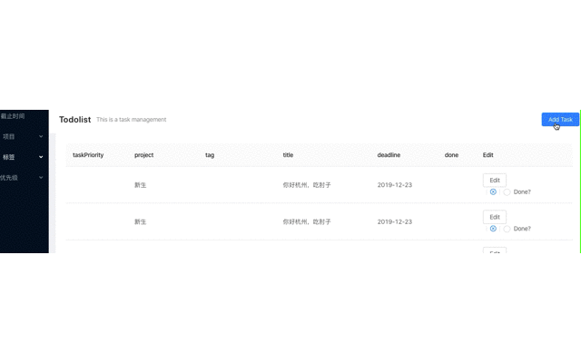

# prework-todolist
> prework

[每日总结记录](./Daily-summary.md)

## 本地跑
1. 打开两个终端
2. 第一个终端进入目录todoBackend，需要pyhton3.6，运行命令`python manage.py runserver`
3. 第二个终端进入目录todo-fore-end, 运行命令`yarn start`
4. 可以尝试页面操作, 但是我使用我本地的postgres数据库

---
预计耗时
7 天之内需要完成
如果 7 天之内无法完成，需要向和你联系的 HR 告知并重新约一个开始做任务的时间

任务要求
使用 Django, Django Rest Framework, Ant Design, PostgreSQL, React 等技术做一个待办事项的网站。

一个参考的例子：https://todoist.com

#### 需要支持的功能：
- [X] 增加一个待办事项
    - 
    - 未解决副作用：刷新页面才生效
- [X] 删除一个待办事项
    - 
- [X] 标记一个待办事项为已完成
    - 
- [X] 编辑一个待办事项的具体内容
    - 
- [X] 列出所有的待办事项
    - 

#### 可选的功能：
- [X] 列表界面支持翻页
    - 
- [] 待办事项可以设置优先级
    - [X] 使用编辑可以实现
    - 任务各属性设置粒度太粗
- [ ] 待办事项可以设置 expire date
    - [X] 使用编辑可以实现
    - 任务各属性设置粒度太粗
- [X] 支持按照不同的方式排序，如优先级，expire date
    - 
    - [X] 后端实现按照优先级，标签，项目排序, 前端实现，前后端数据未接通
    - 
- [ ] API 带有测试用例
    - 用postman测试过所有API
- [ ] 前端使用 TypeScript
- [ ] 配置云服务器，远程ssh连接，增加安全性拒绝ssh直接连接root
    - [X] 购买云服务器
    - [X] 根据digitalOcean文章初始化云服务器ubuntu配置
    - [X] 设置非root用户远程ssh登录连接云服务器
    - [ ] 部署应用

#### 提交
- [X] 在 Github 上创建一个 Repo，把代码传上去
- [X] 在 Repo 的 README.md 中包含你实现了的功能列表，以及各个功能的 GIF 截图
- [ ] （可选）在 AWS / 阿里云 / Digital Ocean / 青云 或者是你的机器上将服务跑起来

附录
GIF 截图工具 - https://www.getcloudapp.com/
截图Jietu (Mac) - https://itunes.apple.com/cn/app/id1059334054?mt=12
Django - https://www.djangoproject.com/ 使用 Django 2.2, Python 3.6
Django Rest Framework - http://www.django-rest-framework.org/
Ant Design - https://ant.design/index-cn/
PostgreSQL - https://www.digitalocean.com/community/tutorials/how-to-use-postgresql-with-your-django-application-on-ubuntu-14-04
React - https://facebook.github.io/react/
React Router - https://reacttraining.com/react-router/
Mobx - https://github.com/mobxjs/mobx
